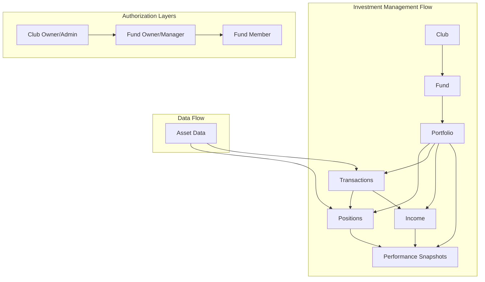
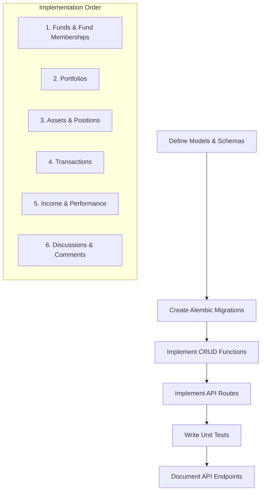
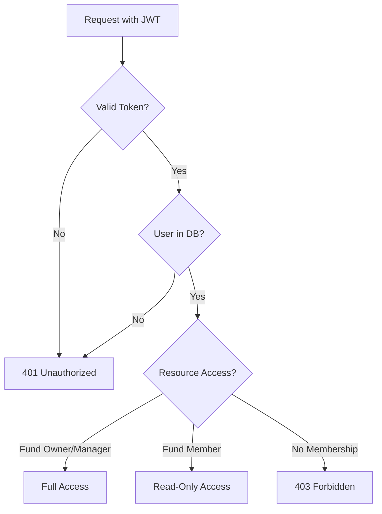
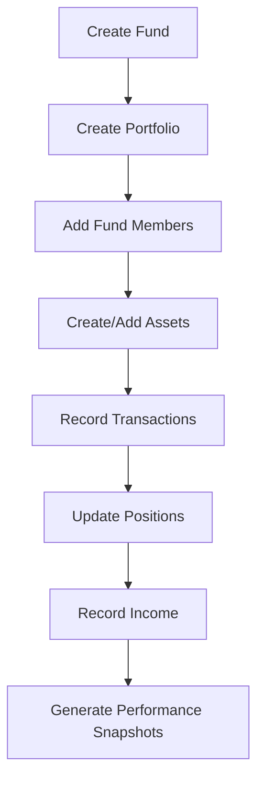

# Sprint 2 Plan: Extended Backend for Investment Operations

**Goal:** Build out the business logic supporting investment management features such as funds, portfolios, transactions, and discussions.

## Key Decisions & Assumptions

- **Prioritization:** Implement in this order: Funds → Portfolios → Positions → Transactions → Income/Performance Snapshots → (Optional) Discussions
- **Asset Data:** Use mock data for ASSET model; Alpha Vantage integration deferred to Sprint 3
- **Cash Management:** Basic Transaction endpoints first; detailed cash management is lower priority
- **Authorization Rules:**
  - Fund Owners/Managers can create/update/delete funds
  - Fund Members can view fund details
  - Only Fund Owners/Managers can create transactions and record income
- **Validation:** Implement basic validation using Pydantic validators (positive quantities, valid transaction types, etc.)

## High-Level Architecture

## Refined Tasks for Sprint 2

### 1. Task 2.1 (Refined): Implement CRUD endpoints for Funds

- **Action:** Define Pydantic schemas in `backend/schemas/fund.py`:
  - `FundCreate`: Fields for creation (name, description, investment_strategy, club_id)
  - `FundRead`: Response model with all fields
  - `FundUpdate`: Fields that can be updated (name, description, investment_strategy, settings)

- **Action:** Implement CRUD functions in `backend/crud/fund.py`:
  - `create_fund`: Creates a fund and associates it with a club
  - `get_fund`: Retrieves a fund by ID
  - `get_funds`: Lists funds (with optional filtering by club_id)
  - `update_fund`: Updates fund details
  - `delete_fund`: Deletes a fund

- **Action:** Implement API routes in `backend/api/funds.py`:
  - `POST /funds`: (Protected) Creates a fund, sets creator as Owner/Manager
  - `GET /funds`: (Protected) Lists funds (with optional club_id filter)
  - `GET /funds/{fund_id}`: (Protected) Gets fund details (requires membership)
  - `PUT /funds/{fund_id}`: (Protected) Updates fund (requires Owner/Manager role)
  - `DELETE /funds/{fund_id}`: (Protected) Deletes fund (requires Owner/Manager role)

- **Action:** Create a new Alembic migration for the Fund model:
  - Use the `backend/scripts/run_all_migrations.py` script to generate and apply the migration

- **Action:** Write unit tests in `backend/tests/test_funds.py`:
  - Test CRUD operations
  - Test API endpoints
  - Test authorization rules

### 2. Task 2.2 (Refined): Create endpoints to manage Fund Memberships

- **Action:** Define Pydantic schemas in `backend/schemas/fund_membership.py`:
  - `FundMembershipCreate`: Fields for creation (fund_id, user_id, role)
  - `FundMembershipRead`: Response model with all fields
  - `FundMembershipUpdate`: Fields that can be updated (role)

- **Action:** Implement CRUD functions in `backend/crud/fund_membership.py`:
  - `create_fund_membership`: Adds a user to a fund
  - `get_fund_membership`: Retrieves a membership by ID
  - `get_fund_memberships`: Lists memberships (with optional filtering by fund_id or user_id)
  - `update_fund_membership`: Updates membership role
  - `delete_fund_membership`: Removes a membership

- **Action:** Implement API routes in `backend/api/fund_memberships.py`:
  - `POST /funds/{fund_id}/memberships`: (Protected) Adds a user to a fund (requires Fund Owner/Manager role)
  - `GET /funds/{fund_id}/memberships`: (Protected) Lists fund members (requires fund membership)
  - `PUT /fund-memberships/{membership_id}`: (Protected) Updates role (requires Fund Owner/Manager role)
  - `DELETE /fund-memberships/{membership_id}`: (Protected) Removes member (requires Fund Owner/Manager role)

- **Action:** Create a new Alembic migration for the FundMembership model:
  - Use the `backend/scripts/run_all_migrations.py` script to generate and apply the migration

- **Action:** Write unit tests in `backend/tests/test_fund_memberships.py`:
  - Test CRUD operations
  - Test API endpoints
  - Test authorization rules

### 3. Task 2.3 (Refined): Implement endpoints for Portfolios

- **Action:** Define Pydantic schemas in `backend/schemas/portfolio.py`:
  - `PortfolioCreate`: Fields for creation (fund_id, name, settings)
  - `PortfolioRead`: Response model with all fields
  - `PortfolioUpdate`: Fields that can be updated (name, settings)

- **Action:** Implement CRUD functions in `backend/crud/portfolio.py`:
  - `create_portfolio`: Creates a portfolio for a fund (ensure uniqueness)
  - `get_portfolio`: Retrieves a portfolio by ID
  - `get_portfolio_by_fund`: Retrieves a portfolio by fund_id
  - `update_portfolio`: Updates portfolio details

- **Action:** Implement API routes in `backend/api/portfolios.py`:
  - `POST /portfolios`: (Protected) Creates a portfolio for a fund (requires Fund Owner/Manager role)
  - `GET /portfolios/{portfolio_id}`: (Protected) Gets portfolio details (requires fund membership)
  - `GET /funds/{fund_id}/portfolio`: (Protected) Gets portfolio by fund ID (requires fund membership)
  - `PUT /portfolios/{portfolio_id}`: (Protected) Updates portfolio (requires Fund Owner/Manager role)

- **Action:** Create a new Alembic migration for the Portfolio model:
  - Use the `backend/scripts/run_all_migrations.py` script to generate and apply the migration

- **Action:** Write unit tests in `backend/tests/test_portfolios.py`:
  - Test CRUD operations
  - Test API endpoints
  - Test authorization rules

### 4. Task 2.4 (Refined): Develop endpoints for Positions

- **Action:** Define Pydantic schemas in `backend/schemas/asset.py` and `backend/schemas/position.py`:
  - `AssetCreate`: Fields for creation (symbol, name, asset_type, current_price)
  - `AssetRead`: Response model with all fields
  - `PositionCreate`: Fields for creation (portfolio_id, asset_id, quantity, average_cost)
  - `PositionRead`: Response model with all fields
  - `PositionUpdate`: Fields that can be updated (quantity, average_cost, current_value)

- **Action:** Implement CRUD functions in `backend/crud/asset.py` and `backend/crud/position.py`:
  - `create_asset`: Creates an asset (or retrieves if exists)
  - `get_asset`: Retrieves an asset by ID or symbol
  - `create_position`: Creates a position in a portfolio
  - `get_position`: Retrieves a position by ID
  - `get_positions`: Lists positions (with optional filtering by portfolio_id or asset_id)
  - `update_position`: Updates position details
  - `delete_position`: Removes a position

- **Action:** Implement API routes in `backend/api/assets.py` and `backend/api/positions.py`:
  - `POST /assets`: (Protected) Creates an asset (requires admin role)
  - `GET /assets`: (Protected) Lists assets (with optional filtering)
  - `POST /positions`: (Protected) Creates a position (requires Fund Owner/Manager role)
  - `GET /positions`: (Protected) Lists positions (with optional filtering)
  - `GET /portfolios/{portfolio_id}/positions`: (Protected) Lists positions for a portfolio (requires fund membership)
  - `PUT /positions/{position_id}`: (Protected) Updates position (requires Fund Owner/Manager role)
  - `DELETE /positions/{position_id}`: (Protected) Deletes position (requires Fund Owner/Manager role)

- **Action:** Create new Alembic migrations for the Asset and Position models:
  - Use the `backend/scripts/run_all_migrations.py` script to generate and apply the migrations

- **Action:** Write unit tests in `backend/tests/test_assets.py` and `backend/tests/test_positions.py`:
  - Test CRUD operations
  - Test API endpoints
  - Test authorization rules
  - Test validation (positive quantities, etc.)

### 5. Task 2.5 (Refined): Implement Transaction endpoints

- **Action:** Define Pydantic schemas in `backend/schemas/transaction.py`:
  - `TransactionCreate`: Fields for creation (portfolio_id, asset_id, transaction_type, quantity, price, date)
  - `TransactionRead`: Response model with all fields

- **Action:** Implement CRUD functions in `backend/crud/transaction.py`:
  - `create_transaction`: Creates a transaction and updates related position
  - `get_transaction`: Retrieves a transaction by ID
  - `get_transactions`: Lists transactions (with optional filtering by portfolio_id, asset_id, date range)

- **Action:** Implement API routes in `backend/api/transactions.py`:
  - `POST /transactions`: (Protected) Creates a transaction (requires Fund Owner/Manager role)
  - `GET /transactions`: (Protected) Lists transactions (with optional filtering)
  - `GET /portfolios/{portfolio_id}/transactions`: (Protected) Lists transactions for a portfolio (requires fund membership)

- **Action:** Create a new Alembic migration for the Transaction model:
  - Use the `backend/scripts/run_all_migrations.py` script to generate and apply the migration

- **Action:** Write unit tests in `backend/tests/test_transactions.py`:
  - Test CRUD operations
  - Test API endpoints
  - Test authorization rules
  - Test position updates after transactions

### 6. Task 2.6 (Refined): Implement endpoints for Income and Performance Snapshots

- **Action:** Define Pydantic schemas in `backend/schemas/income.py` and `backend/schemas/performance_snapshot.py`:
  - `IncomeCreate`: Fields for creation (portfolio_id, asset_id, income_type, amount, date)
  - `IncomeRead`: Response model with all fields
  - `PerformanceSnapshotCreate`: Fields for creation (portfolio_id, fund_id, date, total_value, metrics)
  - `PerformanceSnapshotRead`: Response model with all fields

- **Action:** Implement CRUD functions in `backend/crud/income.py` and `backend/crud/performance_snapshot.py`:
  - `create_income`: Records income for a portfolio/asset
  - `get_income`: Retrieves income by ID
  - `get_incomes`: Lists income records (with optional filtering)
  - `create_performance_snapshot`: Creates a performance snapshot
  - `get_performance_snapshot`: Retrieves a snapshot by ID
  - `get_performance_snapshots`: Lists snapshots (with optional filtering)

- **Action:** Implement API routes in `backend/api/incomes.py` and `backend/api/performance_snapshots.py`:
  - `POST /incomes`: (Protected) Records income (requires Fund Owner/Manager role)
  - `GET /incomes`: (Protected) Lists income records (with optional filtering)
  - `GET /portfolios/{portfolio_id}/incomes`: (Protected) Lists income for a portfolio (requires fund membership)
  - `POST /performance-snapshots`: (Protected) Creates a performance snapshot (requires Fund Owner/Manager role)
  - `GET /performance-snapshots`: (Protected) Lists performance snapshots (with optional filtering)
  - `GET /funds/{fund_id}/performance-snapshots`: (Protected) Lists snapshots for a fund (requires fund membership)

- **Action:** Create new Alembic migrations for the Income and PerformanceSnapshot models:
  - Use the `backend/scripts/run_all_migrations.py` script to generate and apply the migrations

- **Action:** Write unit tests in `backend/tests/test_incomes.py` and `backend/tests/test_performance_snapshots.py`:
  - Test CRUD operations
  - Test API endpoints
  - Test authorization rules

### 7. Task 2.7 (Optional): Add endpoints for Discussion and Comment management

- **Action:** Define Pydantic schemas in `backend/schemas/discussion.py` and `backend/schemas/comment.py`:
  - `DiscussionCreate`: Fields for creation (club_id, fund_id, title, content)
  - `DiscussionRead`: Response model with all fields
  - `CommentCreate`: Fields for creation (discussion_id, content)
  - `CommentRead`: Response model with all fields

- **Action:** Implement CRUD functions in `backend/crud/discussion.py` and `backend/crud/comment.py`:
  - `create_discussion`: Creates a discussion
  - `get_discussion`: Retrieves a discussion by ID
  - `get_discussions`: Lists discussions (with optional filtering)
  - `create_comment`: Creates a comment
  - `get_comment`: Retrieves a comment by ID
  - `get_comments`: Lists comments (with optional filtering)

- **Action:** Implement API routes in `backend/api/discussions.py` and `backend/api/comments.py`:
  - `POST /discussions`: (Protected) Creates a discussion (requires club/fund membership)
  - `GET /discussions`: (Protected) Lists discussions (with optional filtering)
  - `GET /clubs/{club_id}/discussions`: (Protected) Lists discussions for a club (requires club membership)
  - `GET /funds/{fund_id}/discussions`: (Protected) Lists discussions for a fund (requires fund membership)
  - `POST /discussions/{discussion_id}/comments`: (Protected) Creates a comment (requires club/fund membership)
  - `GET /discussions/{discussion_id}/comments`: (Protected) Lists comments for a discussion (requires club/fund membership)

- **Action:** Create new Alembic migrations for the Discussion and Comment models:
  - Use the `backend/scripts/run_all_migrations.py` script to generate and apply the migrations

- **Action:** Write unit tests in `backend/tests/test_discussions.py` and `backend/tests/test_comments.py`:
  - Test CRUD operations
  - Test API endpoints
  - Test authorization rules

### 8. Task 2.8: Write comprehensive unit tests for investment-related endpoints

- **Action:** Ensure all unit tests are comprehensive and cover:
  - Success cases for all CRUD operations
  - Failure cases (validation errors, not found errors, etc.)
  - Authorization rules (proper role checks)
  - Edge cases (e.g., creating a position for a non-existent asset)

- **Action:** Create test fixtures in `backend/tests/conftest.py` for:
  - Fund, FundMembership, Portfolio, Asset, Position, Transaction, Income, PerformanceSnapshot
  - Mock authentication with different roles (Fund Owner, Fund Member)

- **Action:** Ensure test coverage is high for all new modules

### 9. Task 2.9: Update API documentation for new endpoints

- **Action:** Add comprehensive documentation to all new API routes:
  - Use FastAPI's `summary` and `description` parameters
  - Document request/response models
  - Document authorization requirements
  - Document possible error responses

- **Action:** Ensure Swagger UI is properly configured and accessible

## Implementation Flow Diagram

## Authorization Flow

## Data Flow for Investment Operations

## Testing Strategy

- Unit tests for all CRUD operations
- Unit tests for all API endpoints
- Integration tests for key workflows (e.g., creating a transaction and verifying position updates)
- Authorization tests for all protected endpoints