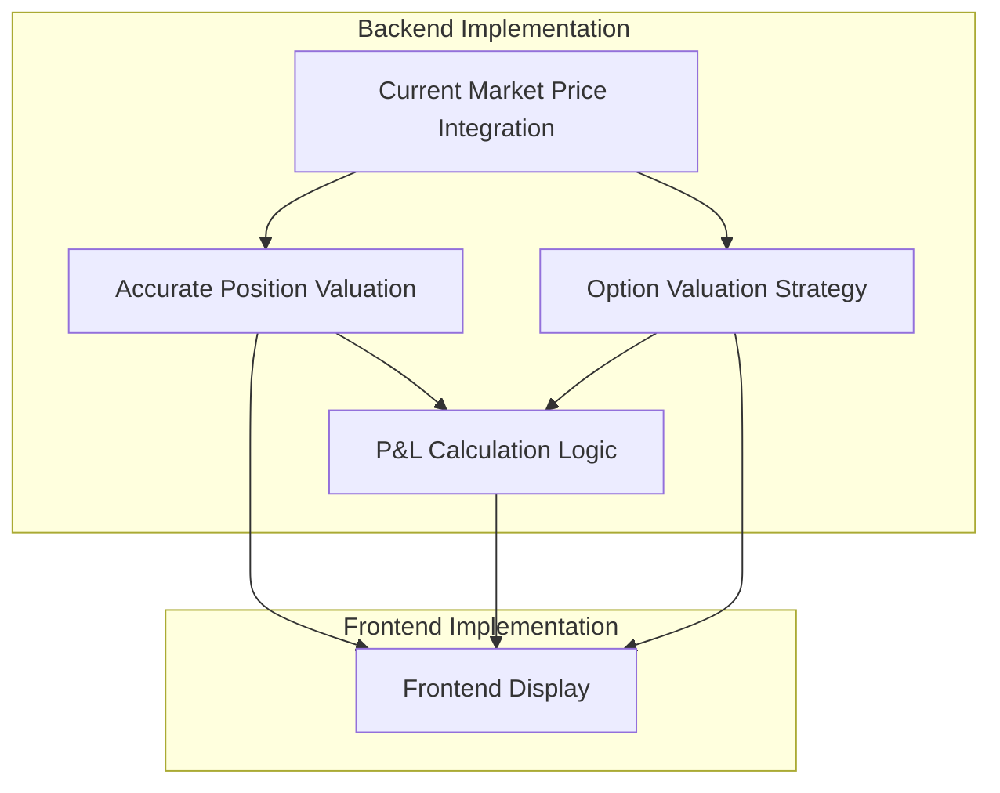

# Priority 1.2 Calculation Features - Implementation Plan

## Overview
This document outlines the implementation plan for the Priority 1.2 Calculation Features bundle. These features are focused on accurate financial calculations and market data integration.

## Dependencies and Flow

## Implementation Steps

### 1. Current Market Price Integration
1. **Research and Select API Provider**
   - Evaluate options: Alpha Vantage, IEX Cloud, Polygon.io, etc.
   - Consider pricing, rate limits, data coverage, and API features
   - Make selection and document decision

2. **API Integration Setup**
   - Enhance existing `get_market_prices` function in `accounting_service.py`
   - Implement API key management (environment variables)
   - Create caching mechanism to minimize API calls
   - Implement rate limiting and error handling

3. **Core Fetching Functions**
   - Improve `get_current_price(asset_id)`: Fetch price for a single asset
   - Enhance `get_current_prices(asset_ids)`: Batch fetch for multiple assets
   - Add `refresh_all_prices()`: Background task to update all prices

### 2. Accurate Position Valuation
1. **Fix Inconsistency in Position Model**
   - Resolve inconsistency between `Position.average_cost_basis` (model) and `position.average_price` (referenced in code)
   - Update all references to use the correct field name consistently

2. **Update Fund Service**
   - Modify `get_fund_detailed` to use current market prices instead of average_cost_basis
   - Calculate total market value of all positions
   - Update percentage calculations based on market values

3. **Update Reporting Service**
   - Ensure all reports use market values instead of book values
   - Add market value vs. book value comparisons

### 3. P&L Calculation Logic
1. **Accounting Method Decision**
   - Finalize accounting method (FIFO, LIFO, or average cost)
   - Document decision and rationale

2. **Unrealized P&L Implementation**
   - Add `unrealized_pl` computed property to Position model
   - Implement calculation: `(current_market_price - average_cost_basis) * quantity`

3. **Realized P&L Implementation**
   - Modify `accounting_service` to calculate realized P&L during sell transactions
   - Store realized P&L in transaction records
   - Implement aggregation functions for reporting

4. **P&L Reporting**
   - Add P&L endpoints to reporting API
   - Implement time-period filtering (YTD, MTD, custom date range)
   - Add position-level, fund-level, and club-level aggregations

### 4. Option Valuation Strategy
1. **Market Price Integration**
   - Extend market data service to handle option symbols
   - Implement option symbol formatting for API requests

2. **Valuation Model Implementation**
   - Create `option_valuation_service.py`
   - Implement Black-Scholes or other appropriate models
   - Add inputs for volatility, risk-free rate, etc.

3. **Position Integration**
   - Update Position model to handle option-specific valuation
   - Integrate with P&L calculations

### 5. Frontend Display Updates
1. **API Client Updates**
   - Add new endpoints for market data and P&L
   - Update types and interfaces

2. **Component Updates**
   - Update `FundDetailPage.tsx` to display market values and P&L
   - Update `PortfolioPage.tsx` with valuation and performance metrics
   - Add P&L visualization components to dashboard

3. **UI Enhancements**
   - Add color coding for positive/negative P&L
   - Implement tooltips explaining calculation methods
   - Add toggle between book value and market value views

## Testing Strategy
1. **Unit Tests**
   - Test each calculation function independently
   - Mock API responses for market data tests
   - Test edge cases (zero quantities, negative prices, etc.)

2. **Integration Tests**
   - Test full calculation flow from market data to frontend display
   - Verify P&L calculations match expected results for sample portfolios

3. **Performance Testing**
   - Benchmark API call performance and caching effectiveness
   - Test with large portfolios to ensure acceptable performance

## Rollout Plan
1. Implement backend features first (market data, valuation, P&L)
2. Add API endpoints for frontend consumption
3. Implement frontend updates
4. Deploy to staging for testing
5. Deploy to production

## Success Criteria
- All positions show accurate market values based on current prices
- P&L calculations match manual verification for test cases
- Option valuations are accurate within acceptable margin of error
- Frontend displays all values correctly and updates when data changes
- API performance meets requirements (response time < 500ms for typical requests)

## Open Questions
1. Which market data API should be selected for current price integration?
2. Which accounting method should be used for realized P&L calculations (FIFO, LIFO, or average cost)?
3. What valuation model is most appropriate for options that don't have readily available market prices?
4. How should we handle the inconsistency between `Position.average_cost_basis` (model) and `position.average_price` (referenced in code)?