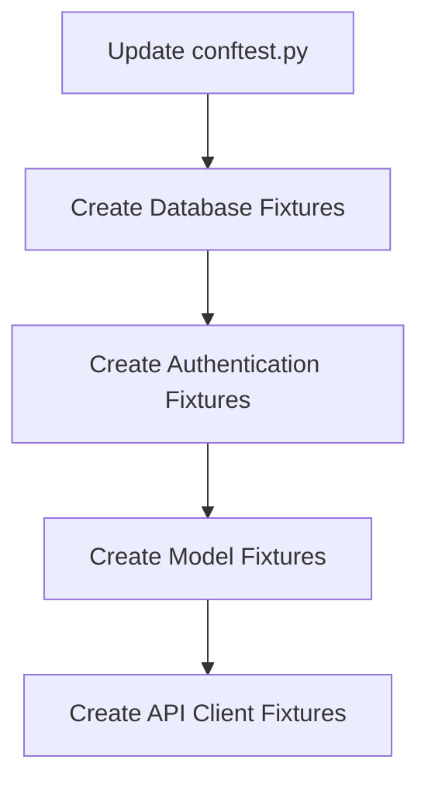
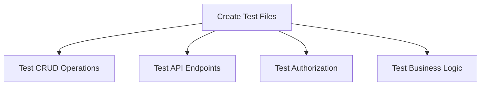

# Sprint 2 Completion Plan

## Overview

Now that we've successfully fixed the migration issue and the database schema is properly set up for Sprint 2 models, we need to focus on the remaining tasks to complete Sprint 2:

1. Create test fixtures for Sprint 2 components
2. Implement test files for Sprint 2 components
3. Verify API documentation for new endpoints

## 1. Create Test Fixtures

We need to update `backend/tests/conftest.py` to include fixtures for all Sprint 2 models:

### Database Fixtures

- Ensure the test database is properly set up
- Create fixtures for database session and transaction management

### Authentication Fixtures

- Create fixtures for different user roles:
  - Fund Manager
  - Fund Member (read-only)
  - Non-member (for testing authorization)

### Model Fixtures

Create fixtures for each model:

1. **Fund Fixtures**
   - `seed_test_fund`: Create a test fund
   - `seed_test_funds`: Create multiple test funds

2. **Fund Membership Fixtures**
   - `seed_test_fund_membership`: Create a test fund membership
   - `seed_test_fund_memberships`: Create multiple test fund memberships with different roles

3. **Portfolio Fixtures**
   - `seed_test_portfolio`: Create a test portfolio linked to a test fund

4. **Asset Fixtures**
   - `seed_test_asset`: Create a test asset
   - `seed_test_assets`: Create multiple test assets

5. **Position Fixtures**
   - `seed_test_position`: Create a test position linking a test portfolio and asset

6. **Transaction Fixtures**
   - `seed_test_transaction`: Create a test transaction
   - `seed_test_transactions`: Create multiple test transactions of different types

7. **Income Fixtures**
   - `seed_test_income`: Create a test income record
   - `seed_test_incomes`: Create multiple test income records

8. **Performance Snapshot Fixtures**
   - `seed_test_performance_snapshot`: Create a test performance snapshot

### API Client Fixtures

- Create fixtures for authenticated API clients with different roles

## 2. Implement Test Files

Create the following test files:

1. `backend/tests/test_funds.py`: Tests for fund CRUD operations and API endpoints
2. `backend/tests/test_fund_memberships.py`: Tests for fund membership operations
3. `backend/tests/test_portfolios.py`: Tests for portfolio operations
4. `backend/tests/test_assets.py`: Tests for asset operations
5. `backend/tests/test_positions.py`: Tests for position operations
6. `backend/tests/test_transactions.py`: Tests for transaction operations
7. `backend/tests/test_incomes.py`: Tests for income operations
8. `backend/tests/test_performance_snapshots.py`: Tests for performance snapshot operations

### Test Structure

Each test file should include:

#### CRUD Operation Tests

- **Create**: Test creating a new resource
  - Test with valid data
  - Test with invalid data (validation errors)
  - Test with duplicate data (if applicable)

- **Read**: Test retrieving resources
  - Test getting a single resource by ID
  - Test listing resources with pagination
  - Test filtering resources (if applicable)

- **Update**: Test updating resources
  - Test with valid data
  - Test with invalid data
  - Test with non-existent resource

- **Delete**: Test deleting resources
  - Test deleting an existing resource
  - Test deleting a non-existent resource

#### API Endpoint Tests

- **Authentication**: Test that endpoints require authentication
  - Test accessing protected endpoints without authentication
  - Test accessing protected endpoints with invalid authentication

- **Authorization**: Test role-based access control
  - Test accessing endpoints with insufficient permissions
  - Test accessing endpoints with appropriate permissions

- **Request Validation**: Test input validation
  - Test with missing required fields
  - Test with invalid field values
  - Test with fields that violate constraints (e.g., negative quantities)

- **Response Format**: Test response structure
  - Test that responses match the expected schema
  - Test that relationships are properly included

#### Business Logic Tests

- **Fund Membership**: Test role-based access to fund operations
  - Test that fund managers can create/update/delete funds
  - Test that fund members can only view funds

- **Transactions**: Test transaction processing
  - Test that creating a buy transaction increases position quantity
  - Test that creating a sell transaction decreases position quantity
  - Test that transactions affect the average cost of positions

- **Income**: Test income recording
  - Test that income records are properly associated with portfolios and assets

- **Performance Snapshots**: Test performance tracking
  - Test that performance snapshots accurately reflect portfolio value

## 3. Verify API Documentation

Ensure all new endpoints have proper documentation:

1. Check that all API routes have appropriate `summary` and `description` parameters
2. Verify that request and response models are properly documented
3. Ensure that authorization requirements are clearly documented
4. Verify that possible error responses are documented

## Implementation Approach

1. Start with creating the test fixtures in `conftest.py`
2. Implement the test files one by one, starting with the most fundamental components (Funds, Fund Memberships)
3. Run tests as they are implemented to catch any issues early
4. Verify API documentation for each component as its tests are completed

## Conclusion

By completing these remaining tasks, we will have fully implemented and tested all the Sprint 2 components, ensuring that they meet the requirements and function correctly. This will provide a solid foundation for Sprint 3 development.